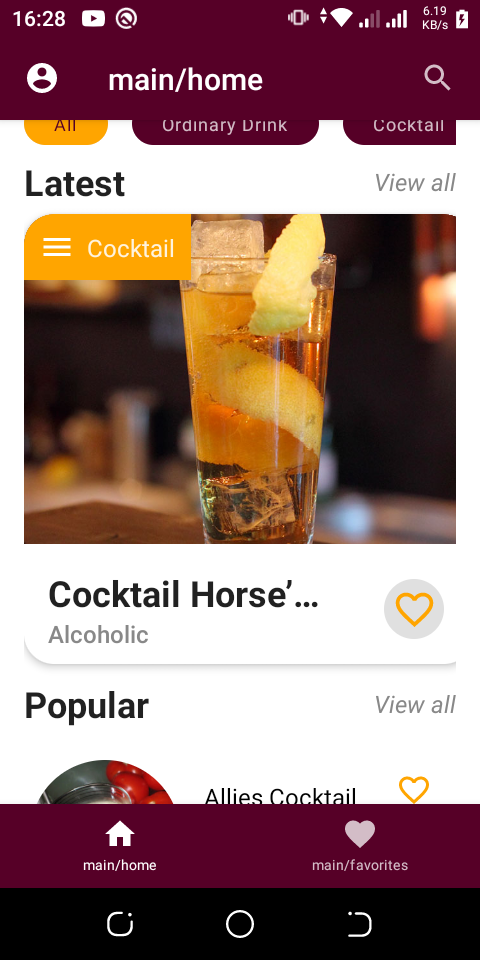

# Pombe App


Play store link. [Playstore](https://play.google.com/store/apps/details?id=com.maku.pombez)

The previous version of the pombe app can be downloaded here [Playstore](https://play.google.com/store/apps/details?id=com.maku.pombe).

Pombe is a sample cocktail app, built with [Jetpack Compose][compose]. The goal of the app is to
showcase how parts of clean architecture components work together. Its also a playground to experiment
with different technologies and collaborate wth other awesome android devs.

To try out this app, you need to use
[Android Studio BumbleBee](https://developer.android.com/studio).
You can clone this repository, build and run it.

### Status: 🚧 In progress 🚧

Pombe is still in the early stages of development, and as such only three screens have been created
so far. However, most of the app's architecture has been implemented, as well as the domain layer,
data layer, presentation layers, and early stages of jetpack compose UI.

## Screenshots



## Features

- __Home__, shows a filter row, latest and popular cocktail lists
  - __Filter__, allowing the user to filter the cocktails according to category
  - __Latest & Popular lists__, show the user a list of cocktails.
  - __Search__, allow users to search for specific cocktail.

## Architecture
- The app has a screaming architecture and is packaged by layered features.
- Each feature has a domain and presentation layer. In each presentation layer, youll find a [Viewtate][viewstate], [Event][event] and [ViewModel][viewmodel] file.
- In the domain layer, we have modeled the domain according to feature. As for this particular app, we have actually reused some data classes, since the the [Pojos][pojos] are the same accross cartain features.
- Special feature like the filter chips fetch data from the [RoomDB][roomdb], which comes auto populated with the different categories. This is so because creating an api end point for the using [Retrofi][retrofit] is redundant and creates technical debt.
- The app is built in a Redux-style, where each UI 'screen' / feature has its own [ViewModel][viewmodel], which depends on a feature view state.
- Each (ViewModel)[viewmodel] is responsible for subscribing to any data streams, in this case the the use-cases, required for the view, as well as exposing functions which allow the UI to send events.

## Data

### Cocktails data

The cocktail data is fetched from the [CocktailDB API](https://www.thecocktaildb.com/api.php).

The [`DrinkRepository`][drinkrepository] class is responsible for handling the data fetching of all cocktail information:

 - Each cocktail is fetched using [OkHttp][okhttp], and then parsed using [Gson][gson].
 - The parsed entities are then added to the local data stores: [`RoomCache`][roomcache], for storage in the local [Room][room] [`PombeDatabase`][db] database.

## Contributions
- Fine the [Contribution Gude here: ](https://github.com/ma-za-kpe/Pombe/blob/master/CONTRIBUTING.md)
- Get API key here: https://www.thecocktaildb.com/api.php
- Fork, clone the app.
  - create a local.properties file
  - add apiKey = <YOUR_API_KEY> in the file
  - build and run the app.
- There are 3 main branches.
  - Master ->
  - beta -> for purposes of QA testing
  - develop -> for collaboration /development purposes
- Before pushing, run the following in your terminal and they must both succeed;
  - gradlew test
  - gradlew connectedAndroidTest
  - Always pul latest changes before attempting to make a PR
- Please create your issue/feature branch from the develope branch. 
- Make PR's to the develope branch

## License
```
MIT License

Copyright (c) 2020 Maku Pauline Mazakpe

Permission is hereby granted, free of charge, to any person obtaining a copy
of this software and associated documentation files (the "Software"), to deal
in the Software without restriction, including without limitation the rights
to use, copy, modify, merge, publish, distribute, sublicense, and/or sell
copies of the Software, and to permit persons to whom the Software is
furnished to do so, subject to the following conditions:

The above copyright notice and this permission notice shall be included in all
copies or substantial portions of the Software.

THE SOFTWARE IS PROVIDED "AS IS", WITHOUT WARRANTY OF ANY KIND, EXPRESS OR
IMPLIED, INCLUDING BUT NOT LIMITED TO THE WARRANTIES OF MERCHANTABILITY,
FITNESS FOR A PARTICULAR PURPOSE AND NONINFRINGEMENT. IN NO EVENT SHALL THE
AUTHORS OR COPYRIGHT HOLDERS BE LIABLE FOR ANY CLAIM, DAMAGES OR OTHER
LIABILITY, WHETHER IN AN ACTION OF CONTRACT, TORT OR OTHERWISE, ARISING FROM,
OUT OF OR IN CONNECTION WITH THE SOFTWARE OR THE USE OR OTHER DEALINGS IN THE
SOFTWARE.
```
